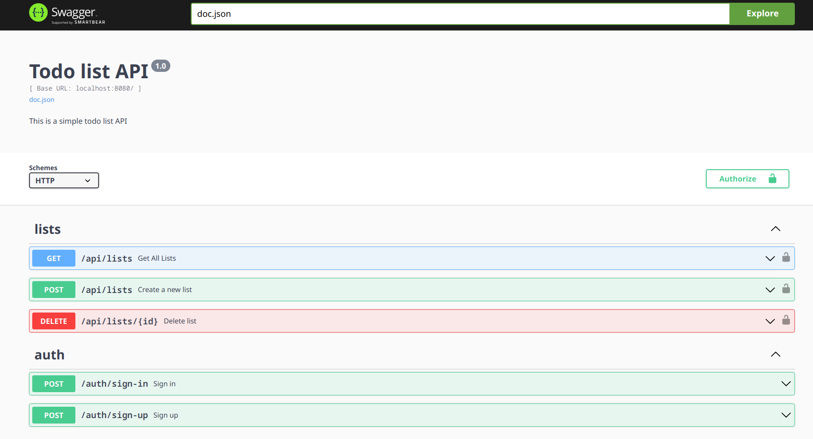

## How to run

Prerequisites

- Make sure you have docker, docker compose plugin installed on your machine

1. Clone the repository
2. Build and run the docker container with compose
    ```shell
    docker compose up --build
    ```
3. Access the swagger documentation [here](http://localhost:8080/swagger/index.html)

### Showcase


## Implemented rest api for todo list app with:

- Postgres DB
- SQL queries
- Clean architecture
- JWT for authentication
- Swagger documentation

## Features

- [x] Create a todo list
- [x] Get all todo list
- [x] Get a todo list
- [x] Update a todo list
- [x] Delete a todo list
- [x] Create a todo item
- [x] Get all todo items
- [x] Get a todo item
- [x] Update a todo item
- [x] Delete a todo item
- [ ] Mark a todo item as done
- [x] Sign up
- [x] Sign in

## Tech Stack
- Go
    - Gin
    - Sqlx
    - JWT
    - cleanenv
    - godotenv
- Docker <- Postgres